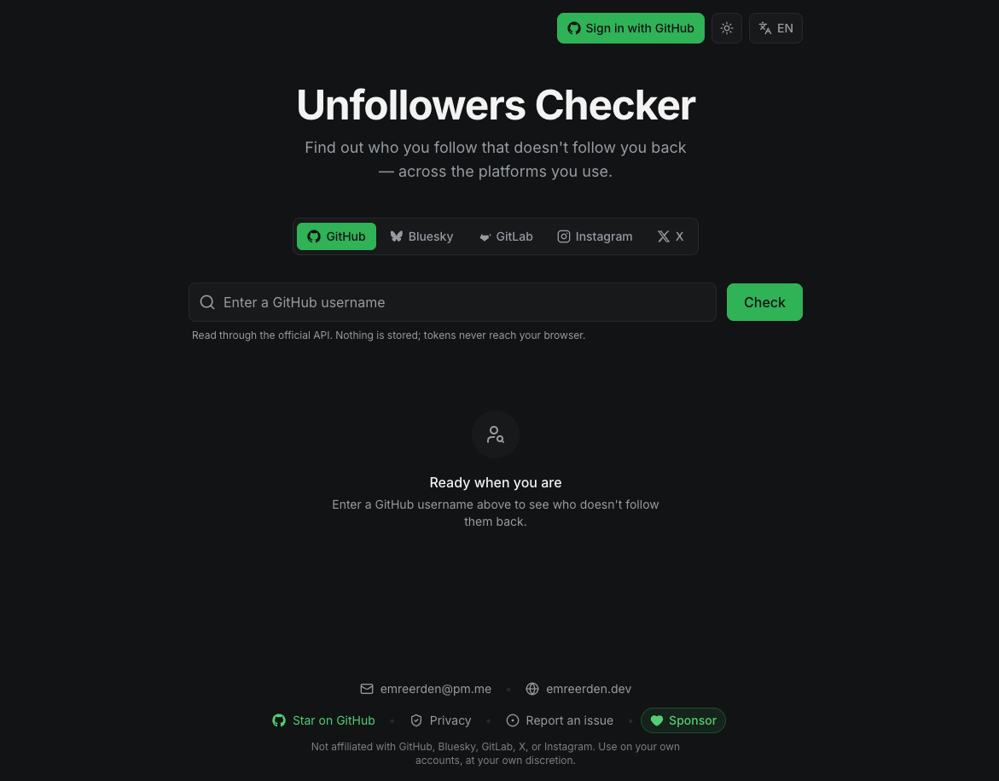

# Unfollowers Checker

See who you follow that doesn't follow you back — across **GitHub**, **Bluesky**, **GitLab**, **X (Twitter)**, and **Instagram**, in one place. Pick a platform, and get the list of accounts you follow who don't follow you back. On GitHub, Bluesky, and GitLab you can sign in and clean it up with one click.

## Platforms

| Platform | View non-followers | Unfollow | How it works |
| --- | :---: | :---: | --- |
| **GitHub** | ✅ | ✅ | Public API, no sign-in needed to view any user. Sign in with GitHub to bulk-unfollow your own list. |
| **Bluesky** | ✅ | ✅ | Public AT Protocol API to view any handle. Sign in with Bluesky to bulk-unfollow your own list. |
| **GitLab** | 🔑 | ✅ | gitlab.com's follow lists aren't public (the API returns 403 without a token), so GitLab is sign-in-only: sign in to view *your own* non-followers and bulk-unfollow. |
| **Instagram** | ✅ | ✅ | A small script you paste into your browser console on instagram.com. It runs in your own session — Instagram has no public follower API, so nothing touches our servers. |
| **X (Twitter)** | ✅ | — | X has no free follower API, so you upload `following.js` / `follower.js` from your official data archive and the diff runs entirely in your browser. Links open each profile so you can unfollow there. |

> Reading X's or Instagram's follower lists isn't possible through a free official API, so those two run fully client-side instead (X via your data archive, Instagram via a console script). LinkedIn has no usable follower-list API at all, so it's out of scope.

## How it works

- **GitHub & Bluesky** — paste a handle (a bare name, an `@handle`, or even a full profile URL all work). The app fetches the account's followers and following lists and shows the difference. Reading is unauthenticated and free; signing in is only needed to unfollow on your own account.
- **GitLab** — sign in with GitLab (gitlab.com). Because GitLab's follower/following lists require authentication, there's no "look up any handle" mode: you sign in once and the app loads *your own* list, where you can bulk-unfollow. Free GitLab OAuth app, no paid plan needed.
- **X (Twitter)** — download your data archive from X (Settings → *Download an archive of your data*), then upload `following.js` and `follower.js` from it. The diff is computed offline in your browser; results link to each profile (X archives only contain numeric account IDs, so handles aren't shown).
- **Instagram** — copy the provided script and paste it into your browser's developer console while on instagram.com. It scans the people you follow using your own session and never sends data to any server.

### Instagram panel features

The pasted script injects a small, self-contained panel into instagram.com. It can:

- **Scan smart** — only checks the people you follow and reads Instagram's follow-back status, so it stays fast even on large accounts.
- **Search & filter** — find by name/username and filter by verified / private / no profile picture, with one-tap "select all verified / private / no-photo" shortcuts.
- **Bulk unfollow** — select accounts and unfollow them in batches, with a live progress bar and a one-click retry for any that failed.
- **Review the outcome** — when it finishes, it lists exactly who was unfollowed (and anyone that failed) so you can see the result.
- **Stay under the radar** — randomized delays and cooldowns keep activity human-like; on rate-limits it automatically backs off and pauses instead of failing silently. (Keep the tab and browser open while it runs.)
- **Tune the timing** — every delay and cooldown is configurable in settings, or reset to the conservative defaults.
- **Comfortable UI** — drag the panel anywhere, resize it from any edge or corner, minimize it, and switch theme (light / dark / system) and language (EN / TR / DE / FR / ES). Your preferences are remembered.

## Privacy & security

- **No data is stored on our servers.** There's no database; follower/following lists are fetched, compared, and returned for a single request — never logged or saved. Your preferences (theme, language, and the Instagram panel's settings/layout) are kept only in your browser's local storage and never sent anywhere.
- Follower data (GitHub, Bluesky, GitLab) is read through serverless functions that hold the API credentials, so tokens never reach the browser. GitHub and Bluesky lists are public; GitLab requires you to sign in first.
- Sign-in tokens are kept server-side (GitHub & GitLab: signed http-only cookie; Bluesky: stored server-side, only the account id rides in the cookie) and are not persisted beyond the actions you take.
- The X archive diff and the Instagram script run entirely client-side in your own browser — your files and session never leave your device.
- Bulk unfollowing affects only your own account, and only after an explicit confirmation.

## Disclaimer

This is a free, personal utility and is **not affiliated with, endorsed by, or connected to** GitHub, Bluesky, GitLab, X (Twitter), or Instagram. Automated or bulk actions can run against a platform's terms of service and may lead to temporary limits or other account actions; the Instagram script in particular is an unofficial, third-party tool. Use these features on your own accounts, at your own discretion.

## Feedback & contact

- **Found a bug or have a request?** [Open an issue](https://github.com/Wiazeph/GitHub-Unfollowers-Checker/issues) on GitHub.
- **Anything else?** Email **emreerden@pm.me** or visit [emreerden.dev](https://emreerden.dev).

## Support

This is a free, ad-free utility maintained in spare time. If it saved you some, you can [**❤️ Sponsor the project**](https://github.com/sponsors/Wiazeph) on GitHub Sponsors — any support helps keep it running and improving.

## Credits

Inspired by the workflows from [cobanov/instagram](https://github.com/cobanov/instagram) and [davidarroyo1234/InstagramUnfollowers](https://github.com/davidarroyo1234/InstagramUnfollowers).
