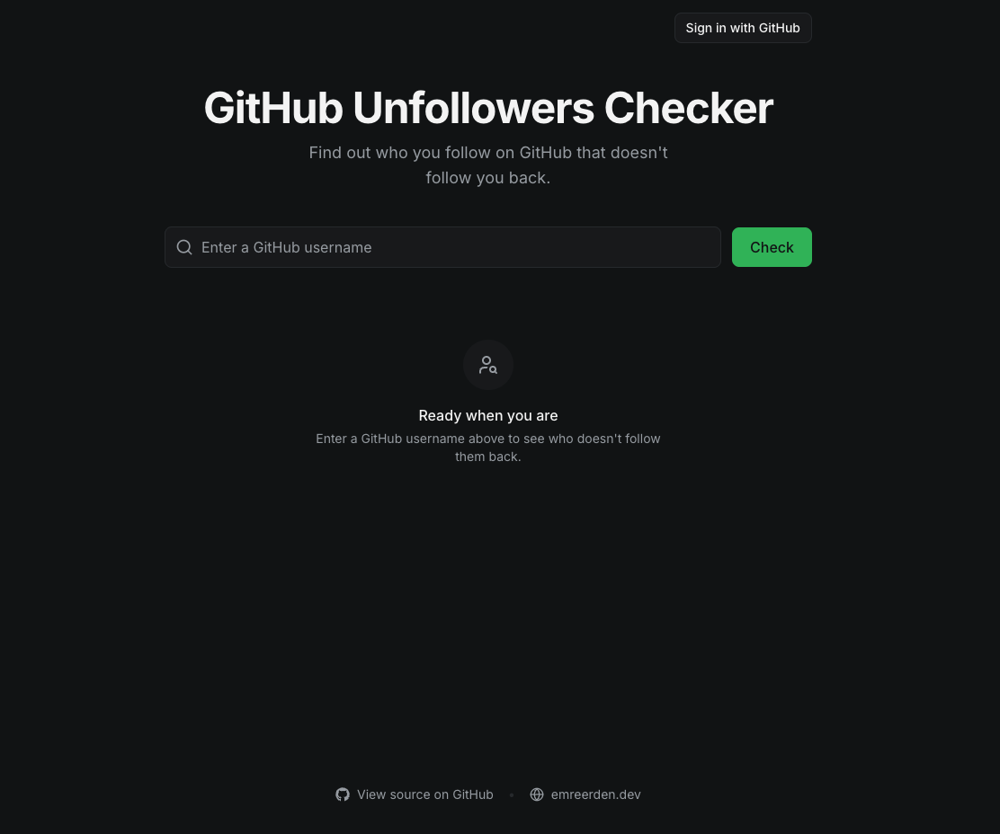

# Unfollowers Checker

See who you follow that doesn't follow you back — across **GitHub**, **Bluesky**, **X (Twitter)**, and **Instagram**, in one place. Pick a platform, and get the list of accounts you follow who don't follow you back. On GitHub and Bluesky you can sign in and clean it up with one click.

## Platforms

| Platform | View non-followers | Unfollow | How it works |
| --- | :---: | :---: | --- |
| **GitHub** | ✅ | ✅ | Public API, no sign-in needed to view any user. Sign in with GitHub to bulk-unfollow your own list. |
| **Bluesky** | ✅ | ✅ | Public AT Protocol API to view any handle. Sign in with Bluesky to bulk-unfollow your own list. |
| **X (Twitter)** | ✅ | — | X has no free follower API, so you upload `following.js` / `follower.js` from your official data archive and the diff runs entirely in your browser. Links open each profile so you can unfollow there. |
| **Instagram** | ✅ | ✅ | A small script you paste into your browser console on instagram.com. It runs in your own session — Instagram has no public follower API, so nothing touches our servers. |

> Reading X's or Instagram's follower lists isn't possible through a free official API, so those two run fully client-side instead (X via your data archive, Instagram via a console script). LinkedIn has no usable follower-list API at all, so it's out of scope.

## How it works

- **GitHub & Bluesky** — paste a handle (a bare name, an `@handle`, or even a full profile URL all work). The app fetches the account's followers and following lists and shows the difference. Reading is unauthenticated and free; signing in is only needed to unfollow on your own account.
- **X (Twitter)** — download your data archive from X (Settings → *Download an archive of your data*), then upload `following.js` and `follower.js` from it. The diff is computed offline in your browser; results link to each profile (X archives only contain numeric account IDs, so handles aren't shown).
- **Instagram** — copy the provided script and paste it into your browser's developer console while on instagram.com. It scans the people you follow using your own session and never sends data to any server.

## Privacy & security

- Public follower data (GitHub, Bluesky) is read through serverless functions that hold the API credentials, so tokens never reach the browser.
- Sign-in tokens are kept server-side (GitHub: signed http-only cookie; Bluesky: stored server-side, only the account id rides in the cookie).
- The X archive diff and the Instagram script run entirely client-side in your own browser — your files and session never leave your device.
- Bulk unfollowing affects only your own account, and only after an explicit confirmation.
